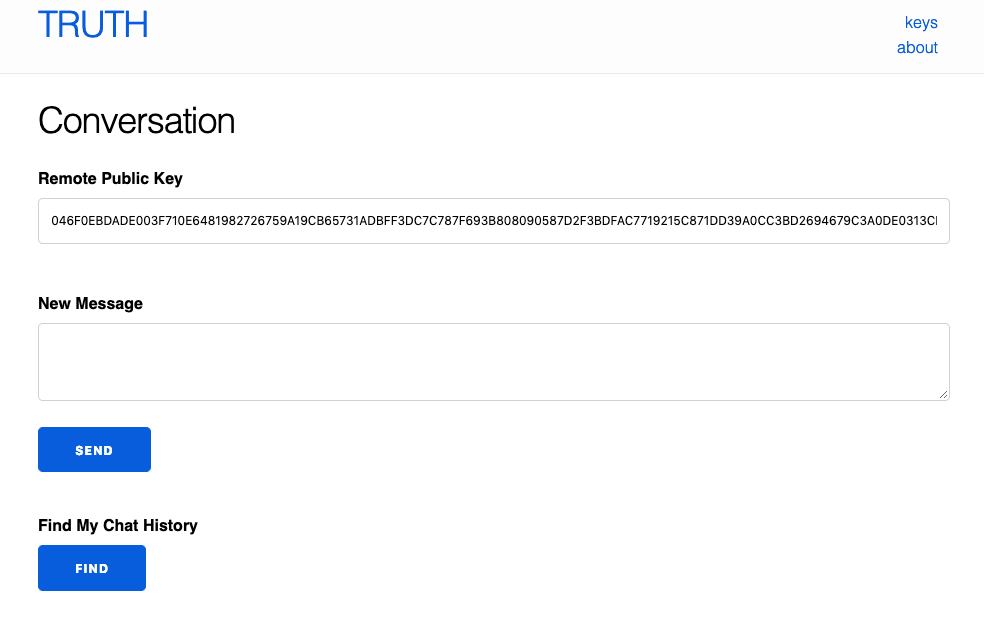

# TRUTH (or Veritas)

TRUTH is a client-side software, which provides a secure and private chat environment, as well as the persistent chat data query.

When people shop online more and more often, even buying foreign goods, or signing a remote labor contract with a foreign company, it is inevitable to communicate online. The preservation of chat records becomes even more important.
We hope that the chat history will not be modified and deleted, and we can confirm the time of each record and the identity of both parties.

# How to install

You need have [elixir](https://elixir-lang.org/) and [phoenix](https://phoenixframework.org/) installed.

To start your Phoenix server:

  * Install dependencies with `mix deps.get`
  * Install Node.js dependencies with `cd assets && npm install`
  * Start Phoenix endpoint with `mix phx.server`

Now you can visit [`localhost:4000`](http://localhost:4000) from your browser.

# How to use

Click the "begin new conversation" button in index page, then you will see the interface below.



- remote public key:
The the public key belongs to who you are chatting with. (default is me).

- new message:
You can type any messages in textarea, then click send button. TRUTH will generate a moneybutton,
with the encrypted message data in opreturn.

- find my chat history:
Query with Bitdb, to find all chat history related to your public key. And decrypt the message.

# What is TRUTH doing

1. When starting, TRUTH will load the `./.keys` file in your disk. If there is no such file, TRUTH will generate one. That includes a ECDH keypair.

    Open "http://localhost:4000", click the "keys" link at navbar, you can visit your keypair.

2. Exchange the public key you saw in the keys page with a person you want to chat. Then fill in his public key in the `remote public key` input box.

    TRUTH will generate a shared ECDH secret from your private key and remote public key. That will be used to encrpt your message.

3. After you entered the information you want to send in the "New Message" textarea, and clicked the "Send" button, TRUTH will construct a transaction according to the following structure:

    ```
    OP_RETURN
    [msg sender's ecdh public key]
    [msg receiver's ecdh public key]
    [encrypted msg]
    ```

    And generate a moneybutton to send this transaction.

4. TRUTH use the following bitdb query to search your chat history (you are sender or receiver):

    ```js
    {
      "v":3,
      "q":{
        "find":{
            "$or": [
              {"out.h1": YOUR_PUBKEY},
              {"out.h2": YOUR_PUBKEY}
            ]
        },
        "limit":10
      }
    }
    ```

    From the transactions, we can get the sender and receiver's public key. Then combine your own private key to generate a secret that can decrypt the message.

# Known bugs

- Since I mishandled the return value of bitdb, if there are unconfirmed chat message transactions, the confirmed chat messages will not show.

- I forgot to generate the corresponding secret based on the public key in each transaction. So if you chatted with different people, "find my chat history" will broken.